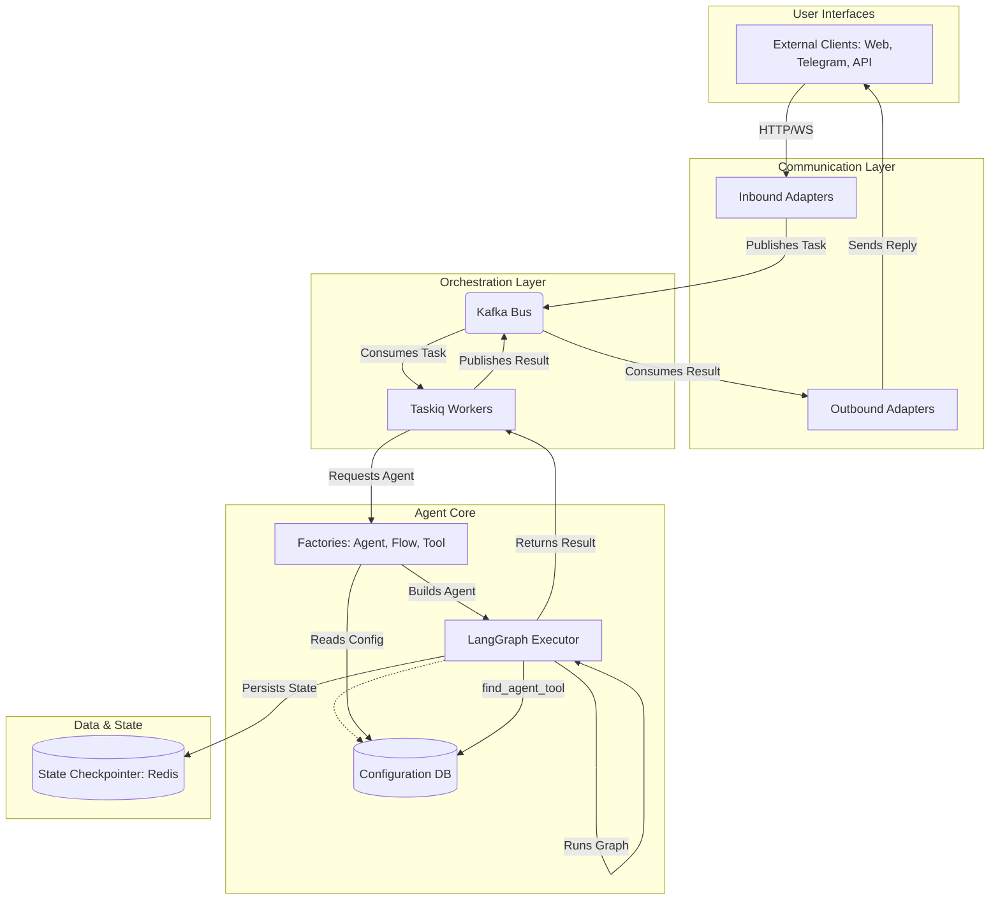

# Архитектура Корпоративной Платформы ИИ-агентов

- [1. Принципы построения](#1-принципы-построения)
- [2. Функциональные зоны](#2-функциональные-зоны)
- [3. Ключевые архитектурные решения](#3-ключевые-архитектурные-решения)
- [4. Нефункциональные требования](#4-нефункциональные-требования)
- [5. Диаграммы](#5-диаграммы)

## 1. Принципы построения

Платформа строится на основе следующих ключевых принципов, обеспечивающих ее гибкость, масштабируемость и готовность к созданию автономных ИИ-организаций:

-   **LangGraph-Native Core**: Вся логика работы агентов, их взаимодействие и управление состоянием строятся на базе LangGraph. Это позволяет использовать самые современные подходы к созданию мульти-агентных систем, включая циклы, ветвления и персистентность состояния "из коробки".

-   **Событийно-ориентированная архитектура (Event-Driven)**: Все взаимодействия внутри системы, от запроса пользователя до выполнения задачи агентом, являются событиями, проходящими через брокер сообщений Kafka. Это полностью разделяет компоненты системы (агентов, сервисы, интерфейсы), позволяя им работать независимо и асинхронно.

-   **Database-First & Configuration as Data**: Конфигурация агентов, флоу и инструментов хранится в базе данных. Код определяет только *поведение* (логику), но не *структуру*. Это позволяет изменять и настраивать агентов на лету без перезагрузки сервисов, что критично для автономных систем.

-   **Расширяемость через Agent Development Kit (ADK)**: Платформа предоставляет четкий и простой API для разработчиков (ADK) для создания новых агентов и инструментов. ADK инкапсулирует сложность взаимодействия с ядром LangGraph и брокером сообщений, позволяя разработчикам фокусироваться на бизнес-логике.

-   **Наблюдаемость (Observability)**: Каждый шаг выполнения агента, каждое событие и изменение состояния трассируется и логируется. Это обеспечивает полную прозрачность работы системы, что необходимо для отладки, мониторинга и анализа поведения автономных агентов. Платформа использует OpenTelemetry как стандарт для сбора данных и Langfuse для их анализа.

-   **Единообразие интерфейсов**: Все агенты, независимо от их сложности и вложенности, имеют единый интерфейс взаимодействия. Агент-супервизор работает с субагентом так же, как и с обычным инструментом (`as_tool`), что позволяет строить иерархии любой глубины.

## 2. Функциональные зоны

Платформа логически разделена на несколько функциональных зон, каждая из которых отвечает за свой аспект работы системы.

-   **Agent Core (Ядро агентов)**:
    -   **Исполнитель (Executor) на базе LangGraph**: Отвечает за компиляцию и выполнение графов агентов. Ядро полностью построено на возможностях LangGraph.
    -   **Фабрики (Factories)**: `AgentFactory`, `FlowFactory`, `ToolFactory` - ключевые компоненты, которые на основе конфигурации из БД собирают "живые" экземпляры агентов, графов и инструментов со всеми зависимостями. Они являются мостом между конфигурацией в БД и исполняемым кодом.

-   **Orchestration Layer (Слой оркестрации)**:
    -   **Брокер сообщений (Kafka)**: Центральная шина для всех событий в системе. Заменяет прямые вызовы и `TaskRepository`. Обеспечивает отказоустойчивость и асинхронность.
    -   **Воркеры (Taskiq)**: Асинхронные обработчики задач, которые подписываются на топики Kafka. Они получают задания, вызывают соответствующий Agent Core для их выполнения и отправляют результат обратно в Kafka.

-   **Communication Layer (Слой коммуникации)**:
    -   **Внешние интерфейсы (Interfaces)**: Адаптеры для различных каналов (Telegram, Web Sockets, API). Они принимают запросы от пользователей, преобразуют их в стандартные события и отправляют в Kafka. Также они слушают Kafka для получения ответов и отправки их пользователям.
    -   **A2A API (Agent-to-Agent)**: Стандартизированный протокол для прямого асинхронного взаимодействия между агентами через Kafka. Позволяет одному агенту вызывать другой, передавать ему задачи и получать результаты.
    -   **Предобработка данных**: Интерфейсы отвечают не только за транспорт, но и за первичную обработку входящих данных. Например, при получении аудио-сообщения или файла, интерфейс скачивает его, передает в соответствующий сервис (`AudioProcessor`, `FileProcessor`), а агенту в Kafka отправляется уже текстовая транскрипция и/или ID сохраненного файла. Это позволяет агентам работать с унифицированными текстовыми данными.

-   **Development Kit & Tooling (ADK)**:
    -   **BaseAgent и декораторы**: Набор базовых классов и утилит, упрощающих создание новых агентов и инструментов.
    -   **CLI и утилиты**: Инструменты для разработчиков для миграции, тестирования и отладки агентов.

-   **State & Memory Layer (Слой состояния и памяти)**:
    -   **Checkpointer**: Стандартный механизм LangGraph для сохранения и восстановления состояния графа (например, в Redis или Postgres). Обеспечивает персистентность диалогов и возможность возобновления работы с прерванного места.
    -   **Общая память (Shared Memory)**: Долгосрочная память и база знаний (например, векторная база данных), доступная всем агентам для хранения и извлечения информации.

## 3. Ключевые архитектурные решения

### 3.1. LangGraph как ядро агентов

Ядром платформы является **LangGraph**. Все агенты, от простых исполнителей до сложных супервизоров, представляют собой скомпилированные графы LangGraph.

-   **Иерархия и внутреннее взаимодействие агентов**: Реализуется **исключительно** через механизм `as_tool`. Любой агент может быть "обернут" и представлен как инструмент для другого, вышестоящего агента. Это позволяет строить вложенные команды агентов (`Team`) и сложные иерархии, где супервизоры делегируют задачи субагентам путем прямого вызова, как обычного Python-инструмента. **Внутреннего A2A-протокола через брокер сообщений не существует**, что делает взаимодействие между агентами внутри системы более простым, быстрым и предсказуемым.

-   **Динамическое возобновление (Interrupt Handling)**: Это ключевая особенность для интерактивного взаимодействия. Когда вложенному агенту требуется информация от пользователя, он вызывает `GraphInterrupt`.
    -   Прерывание "всплывает" вверх по стеку вызовов до Communication Layer.
    -   Система сохраняет полный state графа (включая ID прервавшегося агента) с помощью `checkpointer`.
    -   Сообщение отправляется пользователю.
    -   Когда пользователь отвечает, Communication Layer находит сохраненный state и направляет ответ напрямую в **прерванный узел графа**, а не начинает весь процесс заново с агента-роутера. Это обеспечивает бесшовное продолжение диалога именно с тем агентом, который задал вопрос.

-   **Управление состоянием (State Management)**: Используется единый объект `State` (TypedDict), который передается по всему графу. Он содержит `messages`, `store` (общая память для данных) и другие служебные поля. `Checkpointer` автоматически сохраняет этот `State` после каждого шага, обеспечивая отказоустойчивость.

### 3.2. Kafka и Taskiq для асинхронной оркестрации

Для управления жизненным циклом задач используется связка **Kafka + Taskiq**.

-   **Топики Kafka**:
    -   `tasks.in`: Входящие задачи от пользователей и других систем. Сюда пишут Communication Layer и A2A API.
    -   `tasks.out`: Результаты выполнения задач. Их слушает Communication Layer (для отправки пользователям) и другие агенты (в рамках A2A).
    -   `agent.events`: Служебные события для мониторинга и наблюдаемости (старт/конец задачи, вызов инструмента, ошибка).

-   **Воркеры Taskiq**:
    -   **Обработка задач**: Основная роль воркеров — подписываться на топик `tasks.in`, обрабатывать задачи с помощью `Agent Core` и публиковать результаты в `tasks.out`.
    -   **Периодические системные задачи**: `Taskiq` также используется для запуска регулярных фоновых задач (аналогично cron), таких как синхронизация данных с внешними системами (MCP), очистка старых сессий, синхронизация платежей и т.д. Это заменяет логику, ранее находившуюся в `lifespan.py`, и унифицирует выполнение всех фоновых процессов.

### 3.3. Agent Development Kit (ADK) и Фабрики

ADK — это API и набор инструментов, предоставляемый платформой для упрощения разработки, конфигурации и развертывания агентов.

-   **`BaseAgent`**: Абстрактный класс, от которого наследуются все агенты. Он содержит базовую логику компиляции графа и вызова (`ainvoke`).
-   **Фабрики (`AgentFactory`, `FlowFactory`, `ToolFactory`)**: Являются центральным элементом. Они инкапсулируют логику сборки агентов из конфигурации в БД. Разработчику не нужно вручную создавать экземпляры, он просто описывает конфигурацию, а фабрика сама собирает готовый к работе объект со всеми зависимостями (LLM, тулы, субагенты).
-   **Декораторы (`@tool`)**: Упрощают создание инструментов, автоматически добавляя сериализацию, валидацию и метаданные для биллинга.
-   **Мигратор (Migrator)**: Ключевой компонент ADK, который реализует принцип "Code as Source of Truth". При старте приложения или по команде, мигратор сканирует кодовую базу, находит классы агентов и функции-инструменты, и на их основе автоматически создает или обновляет соответствующие конфигурации в базе данных. Это позволяет разработчикам определять агентов декларативно в коде, а платформа сама делает их доступными для использования через API и UI.

### 3.4. Динамический поиск агентов (Agent Discovery)

Для создания гибких и автономных иерархий платформа предоставляет системный инструмент `find_agent_tool`, который позволяет агентам динамически находить и вызывать других агентов по описанию их функциональности.

-   **Назначение**: Предоставить агентам-супервизорам возможность делегировать задачи не заранее определенным субагентам, а тем, которые наилучшим образом подходят для выполнения конкретной задачи в данный момент.

-   **Принцип работы**:
    1.  Агент-супервизор сталкивается с задачей, которую не может выполнить сам (например, "обработать жалобу на курьера").
    2.  Он вызывает системный инструмент `find_agent_tool(task_description: str)`, передавая текстовое описание задачи.
    3.  Инструмент выполняет семантический поиск по названиям и описаниям (`name`, `description`) всех `AgentConfig` и `FlowConfig`, зарегистрированных в `Configuration DB`.
    4.  Инструмент возвращает `agent_id` или `flow_id` наиболее подходящего исполнителя.
    5.  Супервизор, получив ID, может использовать `AgentFactory` для получения экземпляра этого агента и вызвать его как инструмент (`as_tool`) для выполнения задачи.

Этот механизм превращает платформу из статичной иерархии в динамическую экосистему, где агенты могут находить друг друга "на лету", что является ключевым шагом к построению автономной ИИ-организации.

### 3.6. Унифицированный запрос ввода от пользователя (ask_user)

Для обеспечения интерактивного диалога платформа предоставляет единый механизм запроса информации у пользователя, который работает одинаково для всех типов агентов, включая ReAct.

-   **Проблема**: Простым ReAct-агентам, работающим в цикле "мысль -> действие -> наблюдение", необходим стандартный способ приостановить свою работу, чтобы задать пользователю уточняющий вопрос.

-   **Решение**: Платформа предоставляет системный, доступный для всех агентов инструмент `ask_user(question: str)`.

-   **Механизм**:
    1.  В любой момент, когда агенту (ReAct или StateGraph) требуется информация, он вызывает инструмент `ask_user` с текстом вопроса.
    2.  Реализация этого инструмента не выполняет никаких внешних действий, а немедленно выбрасывает исключение `GraphInterrupt`.
    3.  Это прерывание "всплывает" вверх до `Communication Layer`, который приостанавливает выполнение графа и отправляет вопрос пользователю.
    4.  Когда пользователь отвечает, его ответ направляется обратно в приостановленный граф и возвращается агенту как результат (наблюдение) выполнения инструмента `ask_user`.

Этот подход унифицирует процесс интерактивного взаимодействия и позволяет даже самым простым ReAct-агентам быть полноценными участниками сложного диалога.

### 3.7. Наблюдаемость (Observability): OpenTelemetry и Langfuse

Для обеспечения полной прозрачности и отладки распределенной системы агентов, платформа внедряет комплексный подход к наблюдаемости, основанный на отраслевых стандартах.

-   **OpenTelemetry как стандарт**: Все компоненты платформы (API-шлюзы, воркеры Taskiq, ядро агентов) инструментированы с использованием OpenTelemetry. Это позволяет собирать, коррелировать и экспортировать три основных вида данных:
    -   **Трейсы (Traces)**: Обеспечивают сквозное отслеживание жизненного цикла запроса: от его поступления в `Communication Layer`, через очередь Kafka, до конкретного вызова инструмента внутри вложенного агента и обратно.
    -   **Метрики (Metrics)**: Сбор ключевых показателей производительности (например, время обработки задачи, количество сообщений в Kafka, загрузка воркеров).
    -   **Логи (Logs)**: Структурированные логи, обогащенные идентификаторами трейсов для легкой корреляции.

-   **Langfuse для анализа LLM**: В качестве основного бэкенда для анализа трейсов LLM-операций используется Langfuse. Он интегрируется с OpenTelemetry как специализированный `exporter` и предоставляет:
    -   Детализированную визуализацию выполнения графов LangGraph.
    -   Возможность пошагово отследить ход мыслей агента (thought process), вызовы инструментов и их результаты.
    -   Аналитику по использованию токенов, стоимости и задержкам (latency) для каждого шага.

Такой двухуровневый подход позволяет как получать общую картину состояния системы (через стандартные метрики и трейсы), так и проводить глубокий анализ и отладку поведения конкретных ИИ-агентов.

### 3.5. Google ADK-совместимый A2A-интерфейс: Flow как точка входа

Центральным понятием в A2A API является **"Flow"** (Поток). В контексте нашей платформы, Flow — это публично доступная **точка входа** в определенный бизнес-процесс, реализованный с помощью одного или нескольких агентов. Каждый `flow_id` однозначно идентифицирует корневой агент (супервизор), с которого начинается выполнение задачи. Таким образом, вызов ` /api/v1/invoke/{flow_id}` эквивалентен запуску главного агента для данного бизнес-процесса.

Для обеспечения нативной интеграции с внешней экосистемой AI-агентов, платформа реализует публичный интерфейс, полностью совместимый со спецификацией **Google Agent-to-Agent (A2A)**. Это позволяет любому клиенту или агенту, использующему Google Agent Development Kit (ADK), бесшовно взаимодействовать с агентами нашей платформы.

-   **"Карточка Агента" (Agent Card)**:
    -   Каждый `flow`, помеченный как публичный, автоматически предоставляет "карточку агента" — стандартизированный `JSON` файл.
    -   Эта карточка доступна по публичному URL: `GET /flows/{flow_id}/.well-known/agent-card.json`.
    -   Она содержит всю мета-информацию, необходимую для взаимодействия: описание агента, эндпоинты API, схемы данных (`OpenAPI Schema`) для запросов и ответов.

-   **Аутентификация**: Взаимодействие защищено стандартными механизмами, такими как OAuth 2.0 или API-ключи, как это определено в спецификации Google.

-   **Асинхронный флоу**:
    1.  Внешний ADK-клиент (`RemoteA2aAgent`) считывает `agent-card.json`, чтобы понять, как общаться с нашим агентом.
    2.  Клиент отправляет `POST` запрос на эндпоинт `/invoke`.
    3.  Наш Communication Layer принимает запрос, валидирует его и публикует задачу в Kafka (`tasks.in`), немедленно возвращая `task_id`.
    4.  Дальнейшее получение результата происходит асинхронно через **вебхуки** или **длительные опросы (long polling)**, как это принято в спецификации A2A, вместо простого polling'а. Это обеспечивает более эффективное и нативное взаимодействие для внешних систем.

## 4. Нефункциональные требования

-   **Масштабируемость**: Архитектура на базе Kafka и Taskiq позволяет горизонтально масштабировать количество обработчиков (воркеров) для обработки растущего числа задач. Каждый компонент (интерфейсы, воркеры, сервисы) является stateless и может быть запущен в нескольких экземплярах.

-   **Отказоустойчивость**: Kafka обеспечивает гарантированную доставку сообщений. Если воркер падает во время обработки задачи, сообщение не теряется и будет обработано другим воркером. `Checkpointer` в LangGraph обеспечивает возможность восстановления состояния агента после сбоя.

-   **Безопасность**: Все внешние API-запросы проходят через шлюз с аутентификацией и авторизацией. Для A2A взаимодействия используются внутренние механизмы аутентификации Kafka. Конфигурации и чувствительные данные хранятся в зашифрованном виде.

-   **Производительность**: Асинхронная обработка и слабая связанность компонентов минимизируют задержки. Использование эффективных брокеров сообщений и асинхронных фреймворков (FastAPI, Taskiq) обеспечивает высокую пропускную способность.

-   **Конфигурируемость**: Благодаря подходу "Configuration as Data", поведение системы можно гибко изменять через обновление конфигураций в БД без необходимости переразвертывания кода.

## 5. Диаграммы

### 5.1. Общая архитектура системы

### 5.2. Жизненный цикл задачи (с Interrupt)

### 5.3. Иерархия Агентов (Супервизор и Субагенты)

